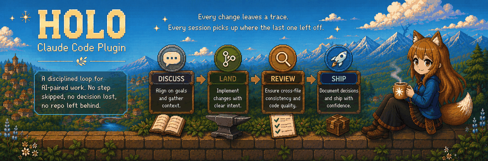
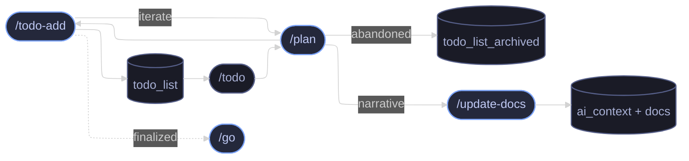
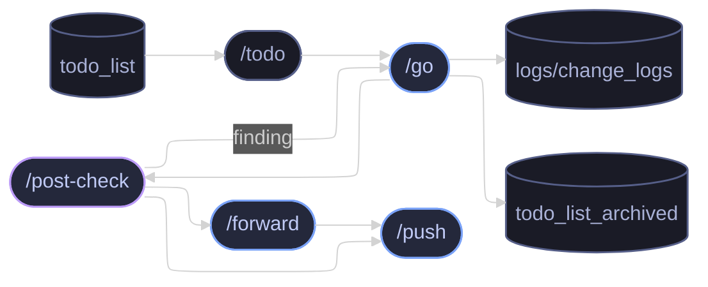
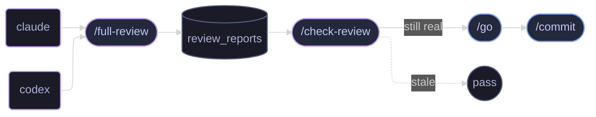

# HOLO

<p align="center">
  
</p>

<p align="center">
  
  <a href="LICENSE"></a>
</p>

HOLO is a Claude Code plugin that pairs an on-disk AI
working-memory framework with a workflow skill suite — the two
together make AI-paired sessions resumable across days, weeks, and
maintainers.

HOLO turns Claude Code into a structured engineering loop. Every
change moves through **discuss → land → review → ship**, with each
stage leaving its own trail on disk — so the next session, whether
tomorrow or a month from now, resumes from exactly where the last one
stopped.

<p align="center">
  <a href="#install">Install</a> ·
  <a href="#update">Update</a> ·
  <a href="#initialize-a-project">Initialize</a> ·
  <a href="#skills--commands">Skills &amp; Commands</a> ·
  <a href="#engineering-loop">Engineering loop</a> ·
  <a href="#configuration">Configuration</a>
</p>

---

## Install

In Claude Code:

```
/plugin marketplace add https://github.com/LeanderLXZ/holo.git
/plugin install holo
```

---

## Update

In Claude Code:

```
/plugin marketplace update holo
/reload-plugins
```

Then, in each project that uses holo, run `/holo:update` to sync any
template / `.agents/skills/` drift introduced by the new plugin
version.

---

## Initialize a project

From inside a new or existing project:

```
/holo:init
```

The command detects current state, copies the template (silent for
new files, interactive `keep` / `overwrite` / `merge` for conflicts),
asks a Step 0 language question plus three rounds of setup questions,
and verifies that no `<...>` placeholders remain.

### What it asks

| Step / Round | Questions | Skippable? |
|---|---|---|
| Step 0 — Language axes (asked first) | `content_language` (disk-bound output) · `conversation_language` (AI ↔ user turns) | No — drives every subsequent skill |
| Round 1 — Project basics | project name · 1–2 sentence project goal · main branch · timezone (Q2's answer fans out to README description + `plugin.json` description + `ai_context/project_background.md §Goal`) | No — required for skill bookkeeping |
| Round 2 — Top-level directory classification | which directories are **source** / **data-contract** / **example-artifact** / **do-not-commit** | Conditional — only asked when extra directories exist (empty / standard skeleton → round skipped automatically) |
| Round 4 — Doc bootstrap (`architecture.md` + `requirements.md`) | per file: **Auto-scan project** / **Manual input** / **Skip for now** | Yes via "Skip for now" — leaves `_(none yet — ...)_` markers in those files for progressive fill later |

The two language axes shape every later skill invocation:

- **`content_language`** — what language the AI writes to disk
  (`ai_context/` / `docs/` / `logs/` / commits / README / new code
  comments). Default `en`; accepts any ISO 639-1 code.
- **`conversation_language`** — what language AI ↔ user turns use.
  Default `auto` (per-turn match the user's last message); accepts
  `auto` or any ISO 639-1 code.

### What you get

```text
your-project/
├── CLAUDE.md                    # Claude Code entry point (auto-loaded each session)
├── AGENTS.md                    # Mirror of CLAUDE.md for Codex / Cursor / other runtimes
├── README.md                    # Starter README for your project (placeholders filled in by /holo:init)
├── .gitignore                   # Sensible defaults for this scaffold
├── ai_context/                  # Cross-session memory — read at every session start
│   ├── README.md                  # Index of ai_context/ (fast project follow-up reference)
│   ├── instructions.md            # Read-order for ai_context/ at session start
│   ├── conventions.md             # Cross-file alignment table + writing rules
│   ├── project_background.md      # Why this project exists — goals, scope, stakeholders
│   ├── requirements.md            # Mirrors docs/requirements.md (lockstep)
│   ├── read_scope.md              # What NOT to load by default
│   ├── current_status.md          # Snapshot of current state — what's done, what's in flight
│   ├── architecture.md            # How the system is built — modules, boundaries, key design
│   ├── decisions.md               # Durable architecture-level decisions log ("why")
│   ├── next_steps.md              # Roadmap — planned directions and priorities
│   ├── handoff.md                 # Quick context for the next session — mental model + what user cares about
│   └── skills_config.md           ★ Per-project anchors read by skills — see §Configuration
├── docs/
│   ├── requirements.md            # User-facing functional spec
│   ├── todo_list.md               # Planned-but-unfinished engineering tasks
│   ├── todo_list_archived.md      # Completed / abandoned (slim)
│   └── architecture/              # Formal architecture documents
└── logs/
    ├── change_logs/               # per-change activity logs (Type: GO = PRE/POST/REVIEW from /go; Type: DO = single-segment from /do)
    └── review_reports/            # /full-review outputs (one file per run)
```

Files marked ★ are the active surfaces every skill touches every day;
the rest of `ai_context/` is read-once-per-session memory the AI relies
on for cross-session continuity.

---

## Skills & Commands

holo ships two distinct entry kinds. **Commands** use the `/holo:`
prefix and operate on the plugin itself. **Skills** are invoked by
bare name and run inside your project. Full documentation for each
entry lives in its source file under [commands/](commands/) or
[skills/](skills/).

### Skills

**Workflow — the daily plan-to-ship loop:**

| Skill | Purpose |
|---|---|
| [`/plan`](skills/plan/SKILL.md) | Lock the current message into discuss-only mode. |
| [`/do`](skills/do/SKILL.md) | **Lightweight** in-place edits for simple, small-scope changes. |
| [`/go`](skills/go/SKILL.md) | **Full-flow** plan-to-ship ceremony for multi-file changes or anything touching `docs/` / `ai_context/`. |
| [`/commit`](skills/commit/SKILL.md) | Drive-by commit of the current working tree, with safety-net checks. |
| [`/push`](skills/push/SKILL.md) | Fast-forward push the current branch to its remote. |
| [`/forward`](skills/forward/SKILL.md) | Merge the current branch into one or more sibling branches. |
| [`/todo-add`](skills/todo-add/SKILL.md) | Register a just-decided item into `docs/todo_list.md`. |
| [`/update-docs`](skills/update-docs/SKILL.md) | Land conversation narrative into `ai_context/` + `docs/` files. |

**Review — audit your work:**

| Skill | Purpose |
|---|---|
| [`/post-check`](skills/post-check/SKILL.md) | Re-validate the last `/go` against its PRE log. |
| [`/full-review`](skills/full-review/SKILL.md) | Whole-repo alignment audit (multi-agent). |
| [`/check-review`](skills/check-review/SKILL.md) | Re-validate a stored review report against current state. |

**Inventory — read-only views:**

| Skill | Purpose |
|---|---|
| [`/todo`](skills/todo/SKILL.md) | Render the `docs/todo_list.md` index. |
| [`/branch-inventory`](skills/branch-inventory/SKILL.md) | Group all local + remote branches by lifecycle bucket. |
| [`/recent-activity`](skills/recent-activity/SKILL.md) | Reverse-chronological timeline of recent project activity. |
| [`/monitor`](skills/monitor/SKILL.md) | Periodic progress report for declared background processes. |
| [`/run-prompt`](skills/run-prompt/SKILL.md) | Load a prompt file and execute its body as the current task. |

### Commands

| Command | Purpose |
|---|---|
| [`/holo:init`](commands/init.md) | Materialize the project skeleton into the current directory. |
| [`/holo:update`](commands/update.md) | Surface structural drift introduced by a plugin upgrade. |

---

## Engineering loop

Three interlocking loops drive the daily cadence — **planning** what
to do next, **implementing** a single change, and **reviewing** after
a batch lands.

### (a) Planning loop

Decide what to do next, or retire ideas that won't make the cut:



`/todo` pulls existing entries out of `todo_list` to feed discussion.
`/plan` and `/todo-add` form a tight loop — every round of `/plan`
records its decision via `/todo-add`, which can either iterate (feed
back into another round of `/plan`) or finalize (hand off to `/go`).
Abandoned ideas go straight to `todo_list_archived`. `/update-docs` is
the prose-narrative sibling of `/todo-add` on the same `/plan`
branch — when a `/plan` round converges into project blueprint /
mental model / architecture / decision narrative that belongs in
`ai_context/` or `docs/` (not a queue entry), `/update-docs` lands it
with the same preview-and-single-confirm UX.

### (b) Implementation loop

Land a single change from queue to remote:



`/todo` pulls a finalized entry from `todo_list`. `/go` implements it
— writing to `logs/change_logs/` and archiving the entry on
completion. `/post-check` then verifies the result; findings loop
back into `/go` for a fix. Once clean, `/forward` is the optional
sibling-branch sync before `/push` ships.

### (c) Review loop

After several commits accumulate, audit the whole repo at once:



`/full-review` dispatches scans across multiple agent runtimes
(claude, codex, etc.) and consolidates findings into
`review_reports/`. `/check-review` re-validates each finding against
the current tree — anything still real loops through `/go` →
`/commit` to fix; anything stale passes. Trigger this before pushing
major work or releasing.

### Walkthrough

A minimal sequence following the implementation loop:

```text
1. /plan                            # discuss the change, no writes
2. /todo-add                        # record the decision into todo_list
3. /go add cache layer to fetcher   # land: edits + cross-file review + commit;
                                    #       finding → /go again to fix
4. /post-check                      # verify; on finding, back to /go
5. /push                            # fast-forward push current branch
```

For small drive-by edits, skip `/plan` and `/go` — edit, then
`/commit && /push`. `/commit` verifies tracking state and writes a
properly-formatted commit, but without the full land ceremony.

---

## Configuration

Most skills read `ai_context/skills_config.md` in your project for
per-project anchors. Missing required header → loud fail. `(none)`
body → graceful skip of the related step. `/holo:init` materializes a
starter `skills_config.md` with every header present and `(none)`
bodies, ready to fill in.

| Section | Used by | Purpose |
|---|---|---|
| `## Background processes` | `/commit`, `/go`, `/monitor`, `/branch-inventory` | pgrep patterns + artifact / log paths so skills detect in-flight long-running jobs on this branch / worktree. |
| `## Protected branch prefixes` | `/commit`, `/go`, `/forward`, `/branch-inventory` | Branch-name prefixes that must not be auto-forwarded or auto-merged. |
| `## Main branch policy` | `/commit`, `/go`, `/branch-inventory` | Main branch name + invariants on what may live there. |
| `## Do-not-commit paths` | `/commit`, `/go` | Project-specific paths that must never be committed, on top of `.gitignore`. |
| `## Source directories` | `/full-review`, `/post-check` | Directories holding code — scope for review scans. |
| `## Data contract directories` | `/full-review`, `/post-check`, `/go` | Schema / Protobuf / OpenAPI / Pydantic / SQL DDL directories — scope for contract validation. |
| `## Example artifact directories` | `/full-review`, `/post-check` | Sample-output / fixture directories — scope for example-vs-spec scans. |
| `## Core component keywords` | `/full-review` | Architectural keywords used in component-alignment audits. |
| `## Sensitive content placeholder rules` | `/go`, `/post-check` | Real-world content that must be replaced by structural placeholders in written artifacts. |
| `## Timezone` | every skill that writes a timestamp | Command template producing `YYYY-MM-DD_HHMMSS`. The section body documents a system-tz `date` fallback (declared once so skills do not encode bespoke try/except). |
| `## Language` | every skill that writes output or asks the user a question | Two independent axes: `content_language` (disk-bound output) and `conversation_language` (AI ↔ user turns). |
| `## Activity sources` | `/recent-activity`, `/todo-add`, `/go`, `/post-check`, `/full-review`, `/check-review`, `/run-prompt` | Paths + filename patterns + per-entry field names for change logs / todo list / archived todo / review reports / prompt sources. |

Each section's body in the generated `skills_config.md` carries inline
documentation of the contract for that section — including the
exceptions to the fail-loud rule (`## Timezone` declares a system-tz
fallback; `scripts/session_branch_check.sh` degrades gracefully when
the section is missing, since it runs before any `/holo:init`).

---

## License

See [LICENSE](LICENSE).
